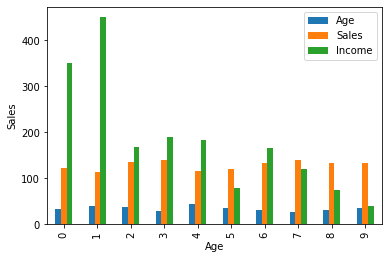
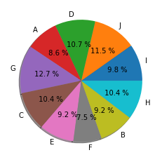

# Data Visualization

Data Visualization is the presentation of data in graphical format. It helps people understand the significance of data by summarizing and presenting huge amount of data in a simple and easy-to-understand format and helps communicate information clearly and effectively.

Different Types of Charts for Analyzing & Presenting Data
   - Histogram
   - Pie-Chart
   - Scatter Plot etc

### Histogram
Bar-Graph Representation

```python

# import pandas and matplotlib 
import pandas as pd 
import matplotlib.pyplot as plt 
  
# create 2D array of table given above 
data = [['E001', 'M', 34, 123, 'Normal', 350], 
        ['E002', 'F', 40, 114, 'Overweight', 450], 
        ['E003', 'F', 37, 135, 'Obesity', 169], 
        ['E004', 'M', 30, 139, 'Underweight', 189], 
        ['E005', 'F', 44, 117, 'Underweight', 183], 
        ['E006', 'M', 36, 121, 'Normal', 80], 
        ['E007', 'M', 32, 133, 'Obesity', 166], 
        ['E008', 'F', 26, 140, 'Normal', 120], 
        ['E009', 'M', 32, 133, 'Normal', 75], 
        ['E010', 'M', 36, 133, 'Underweight', 40] ] 
  
# dataframe created with 
# the above data array 
df = pd.DataFrame(data, columns = ['EMPID', 'Gender',  
                                    'Age', 'Sales', 
                                    'BMI', 'Income'] ) 
  
# create histogram for numeric data 
df.hist() 
  
# show plot 
plt.show()
```

### Column Chart
A column chart is used to show a comparison among different attributes.

```python
df.plot.bar() 
  
# plot between 2 attributes 
plt.bar(df['Age'], df['Sales']) 
plt.xlabel("Age") 
plt.ylabel("Sales") 
plt.show() p[p]
```



### Pie Chart
A circular statistical graph which is divided into slice to illustrate numerical proportion

```python
plt.pie(df['Age'], labels = {"A", "B", "C", 
                             "D", "E", "F", 
                             "G", "H", "I", "J"}, 
                               
autopct ='% 1.1f %%', shadow = True) 
plt.show() 
```

